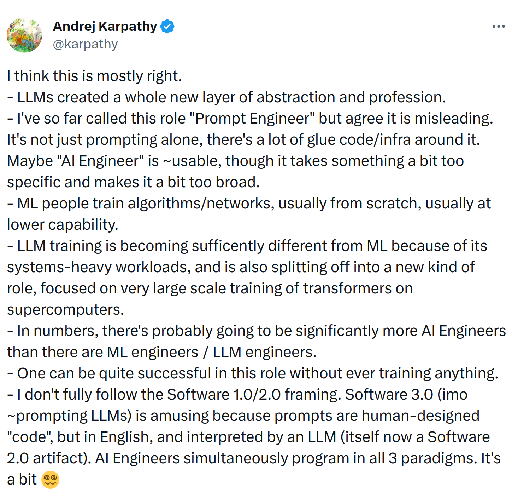

# Introduction

The AI Engineer Handbook is a practical, hands-on guide to AI Engineering. It aims to provide programmers a systematic introduction into building applications which use Large Language Models (LLMs) such as ChatGPT, GPT-4, Anthropic Claude and others. 

When providing code examples, care is taken to avoid the use of frameworks and instead providing code which demonstrates the high-level flow so that you can implement it yourself (or use a framework if you so choose).

## Pre-requisites

This handbook is designed for programmers in mind, in particular programmers who can read/write Python. No prior machine learning or AI knowledge is assumed.

## What is AI Engineering?

Accoring to [@karpathy](https://twitter.com/karpathy/status/1674873002314563584) of OpenAI:

**Key takeaways:**

- AI engineers use LLMs rather than build them

- They operate at a higher level of abstraction than ML engineers or LLM engineers

- AI engineers don't need to know how to build an LLM or a ML model, though it does help to know how they work

- There are some distinct skills which AI engineers do need to know such as:

    - Prompt engineering

    - Working with data

    - LLM infra

    - Evaluating LLMs

Swyx has more on this: [The Rise of the AI Engineer](https://www.latent.space/p/ai-engineer)

## Orientation

This handbook follows the [Diátaxis](https://diataxis.fr) documentation framework.

If you are here to learn, go to **[tutorials](tutorials/rag.md)**. 

**[HOWTOs](HOWTOs/)** on the other hand, are task-oriented and exist to help you problem-solve and accomplish a task. 

The **[theory](theory/)** section is useful when you are looking to dive deeper into how things work.  

The **[reference](reference/glossary/)** section provides a glossary.
